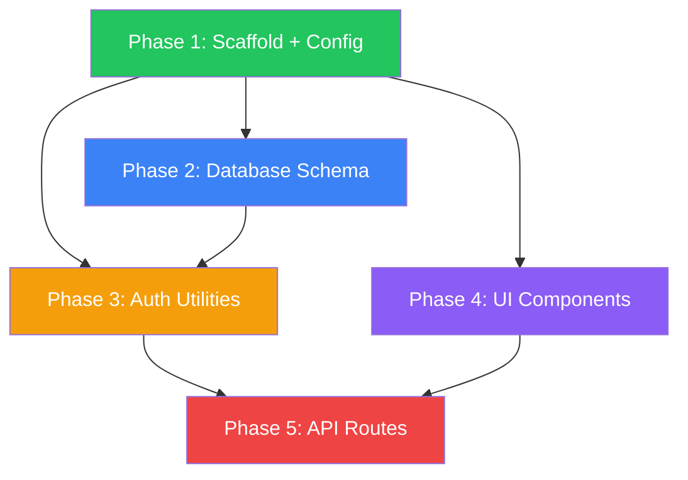

# Next.js SaaS Bootstrap Plan

**Stack:** Next.js 15, TypeScript, Tailwind CSS, shadcn/ui, Prisma, PostgreSQL
**Auth:** Email/password + OAuth (Google, GitHub)
**Created:** 2026-03-12 | **Status:** Ready for Execution

---

## Dependency Graph



### Parallel Execution Matrix

| Phase | Dependencies | Can Run With |
|-------|--------------|--------------|
| Phase 1 | None | - |
| Phase 2 | Phase 1 | Phase 3, 4 |
| Phase 3 | Phase 1, 2 | Phase 4 |
| Phase 4 | Phase 1 | Phase 2, 3 |
| Phase 5 | Phase 2, 3, 4 | - |

---

## File Ownership Matrix

| Phase | Owner | Files |
|-------|-------|-------|
| Phase 1 | `scaffold-agent` | `package.json`, `next.config.ts`, `tailwind.config.ts`, `tsconfig.json` |
| Phase 2 | `database-agent` | `prisma/schema.prisma`, migrations |
| Phase 3 | `auth-agent` | `lib/auth/`, `middleware.ts`, `lib/session.ts` |
| Phase 4 | `ui-agent` | `components/auth/`, `app/(dashboard)/` |
| Phase 5 | `api-agent` | `app/api/auth/`, `app/api/user/` |

---

## Phase 1: Project Scaffold + Configuration

**Priority:** P0 | **Duration:** ~15 min | **Status:** ⏳ Pending

### Overview

Initialize Next.js 15 project with TypeScript, Tailwind CSS, and shadcn/ui base configuration.

### Key Insights

- Next.js 15 uses App Router by default (required for middleware)
- shadcn/ui requires specific Tailwind config setup
- TypeScript strict mode enabled from start

### Requirements

**Functional:**
- Next.js 15 with App Router
- TypeScript strict mode
- Tailwind CSS v4
- shadcn/ui base components
- ESLint + Prettier configured

**Non-Functional:**
- Build time < 30s
- LCP < 2.5s target
- Zero TypeScript errors

### Architecture

```
apps/my-saas-app/
├── app/
│   ├── layout.tsx
│   ├── page.tsx
│   └── globals.css
├── components/
│   └── ui/ (shadcn)
├── lib/
│   └── utils.ts
├── public/
├── package.json
├── next.config.ts
├── tailwind.config.ts
├── tsconfig.json
└── .eslintrc.json
```

### Implementation Steps

1. Run `npx create-next-app@latest my-saas-app --typescript --tailwind --eslint --app --src-dir --import-alias "@/*"`
2. Initialize shadcn/ui: `npx shadcn@latest init`
3. Install base components: `npx shadcn@latest add button card input label`
4. Configure path aliases in tsconfig.json
5. Set up global layout with font optimization

### Todo List

- [ ] Create Next.js 15 project
- [ ] Initialize shadcn/ui
- [ ] Install base UI components (button, card, input, label)
- [ ] Configure TypeScript strict mode
- [ ] Set up ESLint rules
- [ ] Create base layout with metadata

### Success Criteria

- [ ] `npm run build` exits with code 0
- [ ] `npm run lint` passes with 0 errors
- [ ] `npm run dev` starts without errors
- [ ] shadcn/ui components importable
- [ ] TypeScript strict mode: 0 errors

### Risk Assessment

| Risk | Impact | Mitigation |
|------|--------|------------|
| Next.js 15 breaking changes | Medium | Use latest stable, check changelog |
| shadcn/ui config conflicts | Low | Follow official init wizard |

---

## Phase 2: Database Schema + Prisma Models

**Priority:** P0 | **Duration:** ~20 min | **Status:** ⏳ Pending

### Overview

Design and implement PostgreSQL schema with Prisma ORM for user management and sessions.

### Key Insights

- Prisma 6 supports Next.js 15 out of box
- Row-Level Security (RLS) recommended for multi-tenant
- Use UUID for user IDs (security best practice)

### Requirements

**Functional:**
- User model with email/password hash
- Session model for auth persistence
- Account model for OAuth providers
- VerificationToken for email verification

**Non-Functional:**
- Connection pooling configured
- Migration files versioned
- Zero N+1 queries in critical paths

### Architecture

```prisma
model User {
  id            String    @id @default(uuid())
  email         String    @unique
  emailVerified DateTime?
  name          String?
  image         String?
  hashedPassword String?
  createdAt     DateTime  @default(now())
  updatedAt     DateTime  @updatedAt
  accounts      Account[]
  sessions      Session[]
}

model Account {
  id                String  @id @default(uuid())
  userId            String
  type              String
  provider          String
  providerAccountId String
  refresh_token     String? @db.Text
  access_token      String? @db.Text
  expires_at        Int?
  token_type        String?
  scope             String?
  id_token          String? @db.Text
  user              User    @relation(fields: [userId], references: [id], onDelete: Cascade)
  @@unique([provider, providerAccountId])
}

model Session {
  id           String   @id @default(uuid())
  sessionToken String   @unique
  userId       String
  expires      DateTime
  user         User     @relation(fields: [userId], references: [id], onDelete: Cascade)
}

model VerificationToken {
  identifier String
  token      String   @unique
  expires    DateTime
  @@unique([identifier, token])
}
```

### Implementation Steps

1. Install Prisma: `npm install prisma @prisma/client`
2. Initialize: `npx prisma init --datasource-provider postgresql`
3. Create schema.prisma with models above
4. Run migration: `npx prisma migrate dev --name init`
5. Generate client: `npx prisma generate`
6. Create lib/prisma.ts singleton

### Todo List

- [ ] Install Prisma dependencies
- [ ] Create schema.prisma with User, Account, Session, VerificationToken
- [ ] Run initial migration
- [ ] Generate Prisma client
- [ ] Create singleton Prisma client in lib/prisma.ts
- [ ] Add database URL to .env.local

### Success Criteria

- [ ] `npx prisma migrate dev` completes successfully
- [ ] `npx prisma generate` generates client
- [ ] Database connection test passes
- [ ] Schema includes all 4 models
- [ ] RLS policies documented (if Supabase)

### Risk Assessment

| Risk | Impact | Mitigation |
|------|--------|------------|
| Connection pooling limits | Medium | Use PgBouncer or Prisma Accelerate |
| Migration conflicts | Low | Sequential migration naming |

---

## Phase 3: Auth Utilities + Middleware

**Priority:** P0 | **Duration:** ~25 min | **Status:** ⏳ Pending

### Overview

Implement authentication utilities using NextAuth.js v5 (Auth.js) with email/password and OAuth providers.

### Key Insights

- NextAuth.js v5 has different config than v4
- Middleware runs on Edge (must be lightweight)
- JWT strategy recommended for serverless

### Requirements

**Functional:**
- Email/password authentication
- OAuth: Google, GitHub
- Session management (JWT)
- Email verification flow
- Password reset flow
- Protected route middleware

**Non-Functional:**
- Auth checks < 50ms
- Token rotation enabled
- Secure cookies (SameSite=strict)

### Architecture

```
lib/auth/
├── config.ts          # Auth.js configuration
├── providers.ts       # OAuth provider setup
├── credentials.ts     # Email/password strategy
├── adapter.ts         # Prisma adapter
└── index.ts           # Public exports
middleware.ts          # Root middleware
lib/session.ts         # Session helpers
```

### Implementation Steps

1. Install: `npm install next-auth@beta @auth/prisma-adapter`
2. Create auth.config.ts with providers
3. Create credentials provider for email/password
4. Setup Google + GitHub OAuth providers
5. Create middleware.ts with auth guards
6. Create session helper functions

### Todo List

- [ ] Install NextAuth.js v5 + Prisma adapter
- [ ] Configure OAuth providers (Google, GitHub)
- [ ] Implement credentials provider
- [ ] Create auth middleware
- [ ] Add session helper functions
- [ ] Set up environment variables

### Success Criteria

- [ ] `npm run build` passes
- [ ] Middleware protects `/dashboard` routes
- [ ] OAuth flow redirects correctly
- [ ] Email/password login works
- [ ] Session persists across refreshes

### Risk Assessment

| Risk | Impact | Mitigation |
|------|--------|------------|
| OAuth callback URL mismatch | Medium | Use exact URLs in provider console |
| JWT secret exposure | High | Store in .env, never commit |
| Middleware performance | Low | Keep middleware lightweight |

---

## Phase 4: UI Components (Login, Signup, Dashboard)

**Priority:** P1 | **Duration:** ~30 min | **Status:** ⏳ Pending

### Overview

Build authentication UI components with shadcn/ui and protected dashboard layout.

### Key Insights

- Server Components for static content
- Client Components for forms (interactivity)
- Use React Server Actions for mutations

### Requirements

**Functional:**
- Login form with validation
- Signup form with password strength
- OAuth buttons (Google, GitHub)
- Dashboard layout with sidebar
- User profile dropdown
- Loading states + error boundaries

**Non-Functional:**
- Lighthouse accessibility > 90
- Mobile responsive
- Form validation with zod

### Architecture

```
components/
├── auth/
│   ├── login-form.tsx
│   ├── signup-form.tsx
│   ├── oauth-buttons.tsx
│   └── forgot-password-form.tsx
├── dashboard/
│   ├── sidebar.tsx
│   ├── header.tsx
│   └── user-menu.tsx
└── ui/
    ├── loading-spinner.tsx
    └── error-boundary.tsx

app/
├── (auth)/
│   ├── login/page.tsx
│   ├── signup/page.tsx
│   └── forgot-password/page.tsx
└── (dashboard)/
    ├── layout.tsx
    └── dashboard/page.tsx
```

### Implementation Steps

1. Create auth route group `(auth)`
2. Build login-form.tsx with zod validation
3. Build signup-form.tsx with password rules
4. Create OAuth buttons component
5. Create dashboard layout with sidebar
6. Add user profile dropdown menu
7. Implement loading + error states

### Todo List

- [ ] Create (auth) route group with layout
- [ ] Build login form (email, password, submit)
- [ ] Build signup form with password strength
- [ ] Create OAuth button components
- [ ] Create (dashboard) layout with sidebar
- [ ] Add user menu dropdown
- [ ] Implement loading states
- [ ] Add error boundaries

### Success Criteria

- [ ] All forms validate with zod
- [ ] OAuth buttons render correctly
- [ ] Dashboard layout responsive
- [ ] Loading states on all async ops
- [ ] Error boundaries catch failures
- [ ] Lighthouse accessibility > 90

### Risk Assessment

| Risk | Impact | Mitigation |
|------|--------|------------|
| Form validation complexity | Low | Use zod schemas, reuse patterns |
| Responsive design gaps | Low | Test mobile first |

---

## Phase 5: API Routes (Auth, User Management)

**Priority:** P1 | **Duration:** ~20 min | **Status:** ⏳ Pending

### Overview

Implement API routes for authentication endpoints and user management using Next.js Route Handlers.

### Key Insights

- NextAuth.js v5 uses its own route handlers
- Custom routes for user management
- Rate limiting recommended for auth endpoints

### Requirements

**Functional:**
- POST /api/auth/signup - User registration
- POST /api/auth/login - User login
- POST /api/auth/logout - User logout
- GET /api/auth/session - Current session
- GET /api/user/profile - User profile
- PATCH /api/user/profile - Update profile
- POST /api/user/password - Change password

**Non-Functional:**
- Rate limiting on auth endpoints
- Input validation with zod
- Consistent error response format

### Architecture

```
app/api/
├── auth/
│   ├── [...nextauth]/
│   │   └── route.ts       # NextAuth handler
│   ├── signup/
│   │   └── route.ts       # Custom signup
│   └── session/
│       └── route.ts       # Session check
└── user/
    ├── profile/
    │   └── route.ts       # GET/PATCH profile
    └── password/
        └── route.ts       # Change password

lib/
├── validators/
│   ├── auth.ts            # Zod schemas
│   └── user.ts
└── responses/
    └── api-response.ts    # Standard response
```

### Implementation Steps

1. Create NextAuth route handler
2. Implement signup endpoint with email verification
3. Create session check endpoint
4. Build user profile GET/PATCH handlers
5. Add password change endpoint
6. Implement rate limiting middleware
7. Create standard API response helper

### Todo List

- [ ] Create NextAuth route handler
- [ ] Implement signup endpoint
- [ ] Add session check endpoint
- [ ] Build profile GET/PATCH handlers
- [ ] Create password change endpoint
- [ ] Add rate limiting
- [ ] Create standard response format

### Success Criteria

- [ ] All endpoints return consistent format
- [ ] Zod validation on all inputs
- [ ] Rate limiting active on auth routes
- [ ] Session endpoint returns current user
- [ ] Profile updates persist correctly
- [ ] Password change requires current password

### Risk Assessment

| Risk | Impact | Mitigation |
|------|--------|------------|
| Rate limiting false positives | Medium | Use IP + user ID combination |
| Password security | High | Use bcrypt with cost=12 |
| API response inconsistency | Low | Standard response helper |

---

## Success Metrics (Overall)

| Metric | Target | Measurement |
|--------|--------|-------------|
| Build time | < 30s | `time npm run build` |
| TypeScript errors | 0 | `npx tsc --noEmit` |
| Lighthouse a11y | > 90 | Lighthouse audit |
| Auth flow time | < 3s | Manual timing |
| API latency (p95) | < 200ms | API response times |

---

## Unresolved Questions

1. **Email provider:** Should we use Resend, SendGrid, or SMTP for transactional emails?
2. **Database hosting:** Supabase vs managed PostgreSQL (recommend Supabase for RLS)?
3. **Rate limiting:** Upstash Redis or Vercel KV for rate limiting storage?
4. **Analytics:** Include PostHog/Plausible from start or add later?

---

## Next Steps

1. **Immediate:** Run Phase 1 (scaffold) - blocks all other phases
2. **Parallel:** After Phase 1 complete:
   - Phase 2 (database) → blocks Phase 3
   - Phase 4 (UI) → can run independently
3. **Final:** Phase 5 (API) after Phases 2, 3, 4 complete

**Recommended Agent Assignment:**
- Phase 1: `scaffold-agent` or `fullstack-developer`
- Phase 2: `database-agent`
- Phase 3: `auth-agent` or `backend-developer`
- Phase 4: `ui-ux-designer` or `fullstack-developer`
- Phase 5: `api-agent` or `backend-developer`
