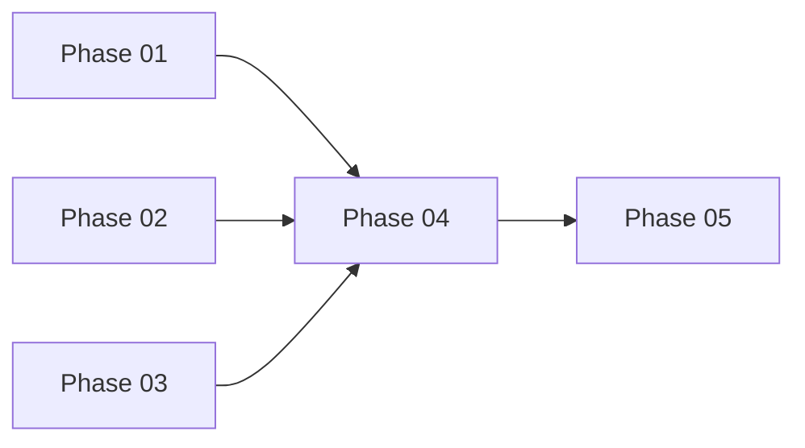

# Polymarket 3-Strategies Implementation Plan

**Date:** 2026-03-12 | **Priority:** High | **Status:** Ready for review

## Overview
Implement 3 new Polymarket strategies into `apps/algo-trader/`:
1. **ListingArbStrategy** — Binance listing announcements → Polymarket YES buys
2. **CrossPlatformArbStrategy** — Polymarket vs Kalshi arbitrage (YES+NO < $1)
3. **MarketMakerStrategy** — Two-sided liquidity, spread capture, maker rebates

## Execution Strategy
**Parallel Groups:**
- **Group A (Parallel):** Phase 01, Phase 02, Phase 03
- **Group B (Sequential):** Phase 04 (depends on A), Phase 05 (depends on A)

```
Phase 01: Kalshi Client ─┐
Phase 02: Binance WS     │ → Phase 04: Integration
Phase 03: Strategies     │ → Phase 05: Tests & Docs
Phase 04: Bot Engine ────┘
Phase 05: Final ─────────┘
```

## File Ownership Matrix

| Phase | Files Owned | Agent |
|-------|-------------|-------|
| 01 | `src/adapters/KalshiClient.ts`, `src/adapters/KalshiWebSocket.ts` | fullstack-dev-1 |
| 02 | `src/adapters/BinanceAnnouncementWS.ts`, `src/strategies/ListingArbStrategy.ts` | fullstack-dev-2 |
| 03 | `src/strategies/CrossPlatformArbStrategy.ts`, `src/strategies/MarketMakerStrategy.ts` | fullstack-dev-3 |
| 04 | `src/polymarket/bot-engine.ts` (update), `src/index.ts` | fullstack-dev-4 |
| 05 | All `tests/`, docs updates | tester + docs-manager |

## Phase Links
- [Phase 01](./phase-01-kalshi-client.md) — Kalshi REST + WebSocket clients
- [Phase 02](./phase-02-binance-listing.md) — Binance CMS + ListingArbStrategy
- [Phase 03](./phase-03-arb-mm-strategies.md) — CrossPlatformArb + MarketMaker
- [Phase 04](./phase-04-bot-integration.md) — Bot engine integration
- [Phase 05](./phase-05-tests-docs.md) — Vitest tests + documentation

## Dependencies


## Success Criteria
- [ ] 3 strategies implemented, tested
- [ ] Vitest tests passing (80%+ coverage)
- [ ] TypeScript compile: 0 errors
- [ ] Git push complete
